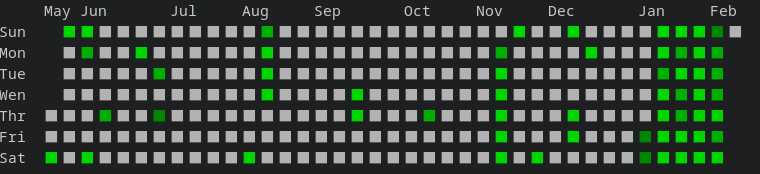

## Getting Started

If you have `go` installed, you can build from source
```sh
go build -o gitContributionGraph cmd/git_contribution_graph/main.go
```

### Github API access token
You can create new access token at https://github.com/settings/tokens, `read:user` scope is enough.

## Usage
### Github Contributions Graph
```sh
gitContributionGraph -token=$GH_CONTRIBUTION_KEY -username=ScaryFrogg
```
By default graph shows current year from beggining until present time. If you want to specify period you can do that by providing `from` and `to` flags using ISO-8601 format.
```sh
gitContributionGraph -token=$GH_CONTRIBUTION_KEY -username=ScaryFrogg -from=2023-01-01T00:00:00Z -to=2023-12-31T23:59:00Z 
```
> **_NOTE:_**  GitHub API doesn't accept period longer than 1 year.
