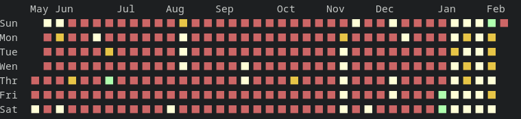

## Getting Started

### Getting the binary
If you have `go` installed, you can build from source
```sh
go build -o gcg cmd/git_contribution_graph/main.go
```
Or download from [releses page](https://github.com/ScaryFrogg/git_contribution_graph/releases/).

### Github API access token
If you want to use github mode, you need to create new access token at https://github.com/settings/tokens, `read:user` scope is enough.

### Dependencies
Only dependency needed is `git`.

## Usage

### Github Contributions Graph
```sh
gcg -token=$GH_CONTRIBUTION_KEY -username=ScaryFrogg
```


By default graph shows current year from beggining until present time. If you want to specify period you can do that by providing `from` and `to` flags using ISO-8601 format.
```sh
gcg -token=$GH_CONTRIBUTION_KEY -username=ScaryFrogg -from=2023-01-01T00:00:00Z -to=2023-12-31T23:59:00Z 
```

> **_NOTE:_**  GitHub API doesn't accept period longer than 1 year.

### Local Git reposetories
This is the default mode and you and it is activated when no `tokem` is provided.
Options `from` and `to` are optional and work the same as in github mode.

To add gcg to run after you change directory in terminal and print if you are inside repo you can add something like this in your .bashrc or equivalent file for other shells:

```bash
function cd {
    builtin cd "$@" && gcg
}
```

### Additional Options
* `colors` : lets you provide custom colors for squares in the graph, format should be 5 [ANSI 256](https://hexdocs.pm/color_palette/ansi_color_codes.html) color codes separated by comma.
```bash
gcg -colors=1,230,11,157,10 -token=$GH_CONTRIBUTION_KEY -username=ScaryFrogg -from=2024-05-23T00:00:00Z 
```

* `legend` :  by default set to `true` if set to `false` will remove months and weekdays from output
 ```bash
gcg -legend=false -token=$$GH_CONTRIBUTION_KEY -username=ScaryFrogg -from=2024-05-23T00:00:00Z 
```


